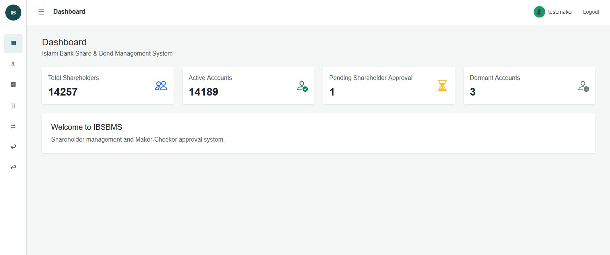
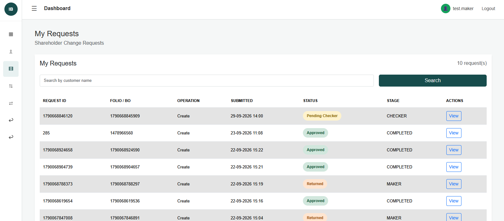
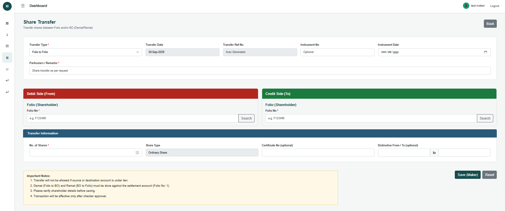
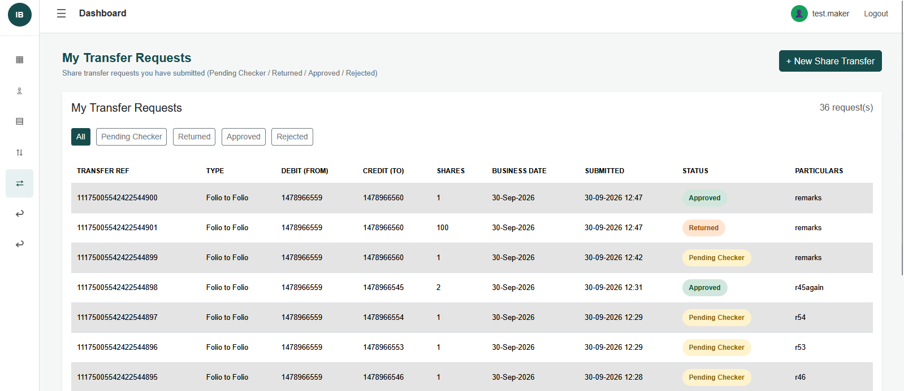

# IBSBMS – Islami Bank Share & Bond Management System

IBSBMS (Islami Bank Share & Bond Management System) is a web-based shareholder and share transfer management system developed as part of an internship project.

The system manages shareholder account information, shareholder changes, and share transfer operations through controlled **Maker–Checker approval workflows**.

---

## Features

### Shareholder Management

* Shareholder account listing
* Search shareholder accounts by Folio number
* Search shareholder accounts by BO number
* Display related BO information separately from shareholder records
* Create new shareholder records
* Modify existing shareholder information
* Read-only shareholder details view
* Returned request resubmission

### Maker–Checker Workflow

* Maker–Checker approval workflow
* Checker approval, rejection, and return for modification
* Maker view of submitted requests
* Returned request modification and resubmission
* Approval and rejection history
* Business audit tracking
* Role-based access control

### Share Transfer

* Share Transfer module
* Folio-to-Folio share transfer
* Folio-to-BO share transfer (Dematerialization)
* Maker submission of transfer requests
* Checker review of transfer requests
* Checker approval, rejection, and return for modification
* Returned transfer request resubmission
* Share balance validation
* Source account validation
* Lien and inactive account validation
* Same-source/destination validation
* Transaction and movement records
* Oracle database balance updates
* Audit tracking
* Concurrent approval protection

### Dashboard

* Database-driven shareholder statistics
* Total shareholders
* Active accounts
* Pending approvals
* Dormant accounts
* Dashboard overview of the system

### User Interface

* Role-based sidebar navigation
* Separate navigation for shareholder approvals and share transfer approvals
* Shareholder Change Requests section
* Share Transfer requests and approvals
* Responsive Bootstrap-based interface
* Shared header and sidebar components


## Screenshots

### Dashboard

The dashboard provides an overview of shareholder accounts, active accounts, and pending approvals.



### Shareholder Change Requests

The module provides shareholder maker change requests.



### Share Transfer

The Share Transfer module supports controlled share transfer operations through the Maker–Checker workflow.



### Share Transfer Requests

The module shows lists of share transfer requests from maker side.



---

## Technology Stack

### Backend

* Java 21
* Spring Boot 4.1.1
* Spring MVC
* Spring Data JPA
* Hibernate
* Maven
* Spring Security

### Frontend

* HTML5
* CSS3
* Thymeleaf
* Bootstrap 5.3.3

### Database

* Oracle Database
* Oracle JDBC Driver (ojdbc17)

### Development Tools

* IntelliJ IDEA
* Git
* GitHub

---

## System Architecture

The application follows a layered architecture:

```text
+-----------------------------+
|          Browser            |
|     Thymeleaf + Bootstrap   |
+-------------+---------------+
              |
              v
+-----------------------------+
|        Controller Layer     |
|      Spring MVC Controllers |
+-------------+---------------+
              |
              v
+-----------------------------+
|         Service Layer       |
|    Business Logic / Workflow|
+-------------+---------------+
              |
              v
+-----------------------------+
|       Repository Layer      |
|       Spring Data JPA       |
+-------------+---------------+
              |
              v
+-----------------------------+
|       Oracle Database       |
+-----------------------------+
```

---

# Maker–Checker Workflow

The system uses a Maker–Checker workflow to control shareholder and share transfer operations.

## Shareholder Change Workflow

```text
             MAKER
               |
               | Create / Modify
               v
        Submit Request
               |
               v
       PENDING_CHECKER
               |
        +------+------+
        |             |
        v             v
     CHECKER      CHECKER
     Approve      Reject
        |             |
        v             v
    APPROVED       REJECTED
```

A Checker can also return a request for modification:

```text
Maker
  |
  v
Submit
  |
  v
Pending Checker
  |
  v
Return for Modification
  |
  v
Maker modifies request
  |
  v
Resubmit
  |
  v
Pending Checker
```

## Share Transfer Workflow

```text
             MAKER
               |
               | Create Transfer
               v
        Submit Transfer
               |
               v
       PENDING_CHECKER
               |
        +------+------+
        |      |      |
        v      v      v
     APPROVE  REJECT  RETURN
        |               |
        v               v
     POSTED          MAKER
                    Resubmits
```

The transfer approval process validates the source account, transfer quantity, transfer type, and destination before posting the transaction.

---

# User Roles

## Maker

The Maker can:

* View shareholder accounts
* Search shareholder accounts
* View BO information
* Create shareholder requests
* Modify shareholder information
* Submit requests for approval
* View shareholder change requests
* View returned shareholder requests
* Modify and resubmit returned shareholder requests
* Create share transfer requests
* View their transfer requests
* Modify and resubmit returned transfer requests

## Checker

The Checker can:

* View shareholder accounts
* Search shareholder accounts
* View BO information
* View pending shareholder approval requests
* Review shareholder changes
* Approve shareholder requests
* Reject shareholder requests
* Return shareholder requests for modification
* View rejected shareholder requests
* View returned shareholder requests
* View pending share transfer requests
* Review transfer requests
* Approve share transfers
* Reject share transfers
* Return share transfers for modification

---

# Database Design

## Shareholder Tables

The main shareholder tables are:

```text
T_ACCOUNT_SHARE
        |
        +---- T_ADDRESS_SHARE
        |
        +---- T_BANKINFO_SHARE
```

## Shareholder Workflow Tables

```text
T_SHAREHOLDER_CHANGE_REQUEST
              |
              v
      T_APPROVAL_REQUEST
              |
              v
       T_APPROVAL_ACTION
              |
              v
       T_BUSINESS_AUDIT
```

## Share Transfer Tables

Share transfer operations use the existing IBSBMS transaction and movement tables, including:

```text
T_SHARE_MOVEMENT
T_TRANS_SHARE
T_TRANS_AUTH
T_TR_TYPE
T_TR_CODE
T_CDBL_OUT_BATCH
T_CDBL_OUT_ITEM
```

For dematerialization, the system also interacts with BO account information stored in:

```text
T_ACCOUNT_CDBL
```

---

## Main Tables

| Table                          | Purpose                                      |
| ------------------------------ | -------------------------------------------- |
| `T_ACCOUNT_SHARE`              | Stores shareholder account information       |
| `T_ADDRESS_SHARE`              | Stores shareholder address information       |
| `T_BANKINFO_SHARE`             | Stores shareholder bank information          |
| `T_ACCOUNT_CDBL`               | Stores BO account information and balances   |
| `T_SHAREHOLDER_CHANGE_REQUEST` | Stores proposed shareholder changes          |
| `T_APPROVAL_REQUEST`           | Stores approval workflow state               |
| `T_APPROVAL_ACTION`            | Stores approval/rejection/return history     |
| `T_BUSINESS_AUDIT`             | Stores business audit information            |
| `T_SHARE_MOVEMENT`             | Stores share movement records                |
| `T_TRANS_SHARE`                | Stores share transaction entries             |
| `T_TRANS_AUTH`                 | Stores transaction authorization information |
| `T_CDBL_OUT_BATCH`             | Stores CDBL output batches                   |
| `T_CDBL_OUT_ITEM`              | Stores CDBL output items                     |

---

# Shareholder Operations

## Create

The Maker enters:

* Basic shareholder information
* Address information
* Optional bank information

The system creates a change request and sends it to the Checker.

The shareholder master record is finalized after approval.

## Modify

The Maker selects an existing approved shareholder and edits permitted information.

The system stores:

* Previous values
* New values
* Maker information
* Change request information
* Approval workflow information

The changes are applied to the master data only after Checker approval.

Financial/shareholding values such as shares, suspense, bonus, and balance are not modified through the shareholder modification workflow.

---

# Shareholder Search

The Shareholder page supports a unified search field.

Users can search using:

```text
Folio Number
```

or

```text
BO Number
```

When a BO number is searched, the system identifies the associated Folio through the existing share movement relationship.

The BO information is displayed separately from the shareholder table rather than being added as a shareholder table column.

BO information can include:

* BO Number
* BO Name
* Shares / Current Balance
* BO Status
* Balance information

This keeps the shareholder record and BO account information visually separate.

---

# Share Transfer

The Share Transfer module supports controlled movement of shares between shareholder and BO accounts.

## Folio-to-Folio

A Folio-to-Folio transfer moves shares between two shareholder accounts.

The workflow includes:

1. Source Folio validation
2. Destination Folio validation
3. Share quantity validation
4. Source balance validation
5. Source account status validation
6. Lien validation
7. Same-source/destination validation
8. Transfer request creation
9. Checker approval
10. Transaction posting
11. Audit recording

## Folio-to-BO

The Folio-to-BO workflow represents dematerialization of shares.

The workflow includes:

1. Source Folio validation
2. BO validation
3. Available share validation
4. Source account status validation
5. Lien validation
6. Transfer request creation
7. Share movement creation
8. CDBL output record creation
9. Source balance update
10. BO balance update
11. Transaction authorization
12. Audit recording

---

# Share Transfer Validation

The transfer module performs validations including:

* Source account existence
* Destination account existence
* Source account validity
* Source account lien status
* Available share balance
* Positive transfer quantity
* Integer share quantity
* Same-source/destination prevention
* Valid transfer type
* Maker/Checker authorization

Decimal share quantities are rejected where the database business rules require whole shares.

---

# Transaction and Movement Records

Share transfers are recorded using the IBSBMS transaction and movement structures.

Transfer movement information includes concepts such as:

```text
SOURCE_TYPE
SOURCE_REF
TARGET_TYPE
TARGET_REF
MOVEMENT_TYPE
LOCAL_STATUS
CDBL_STATUS
```

For example, a Folio-to-BO dematerialization movement represents:

```text
SOURCE_TYPE = FOLIO
TARGET_TYPE = BO
```

with the relevant Folio and BO references.

Share transfer transaction types are mapped using the existing IBSBMS transaction configuration.

---

# Concurrency and Approval Protection

The Share Transfer module includes protection against duplicate or concurrent approval operations.

The approval process uses transaction boundaries and account locking where required to prevent inconsistent balance updates.

This ensures that two simultaneous approval attempts cannot incorrectly post the same transfer twice.

---

# Project Structure

The main application structure follows the standard Spring Boot organization:

```text
src/
└── main/
    ├── java/
    │   └── com.example.ibsbms/
    │       ├── config/
    │       ├── controller/
    │       ├── dto/
    │       ├── entity/
    │       ├── enums/
    │       ├── repository/
    │       └── service/
    │
    └── resources/
        ├── static/
        │   └── css/
        ├── templates/
        │   ├── approval/
        │   ├── shareholder/
        │   ├── share-transfer/
        │   └── fragments/
        └── application.properties
```

---

# Security

Spring Security is used for authentication and role-based authorization.

The system currently uses two roles:

```text
MAKER
CHECKER
```

Examples:

```text
/shareholders/create
    → MAKER

/shareholders/*/edit
    → MAKER

/shareholders/returned/**
    → MAKER

/my-requests/**
    → MAKER

/share-transfer/**
    → MAKER

/approvals/**
    → CHECKER

/share-transfer/checker/**
    → CHECKER

/shareholders
    → MAKER + CHECKER
```

---

# Dashboard

The dashboard provides an overview of the shareholder management system using database-driven statistics.

Current dashboard information includes:

* Total Shareholders
* Active Accounts
* Pending Approvals
* Dormant Accounts

The statistics are retrieved from Oracle Database through the repository and service layers rather than being hardcoded.

The dashboard also provides a central landing page for the IBSBMS application.

---

# Navigation

The application uses a shared sidebar and header structure.

The navigation separates shareholder operations from share transfer operations.

Major navigation sections include:

```text
Dashboard
Shareholders
New Shareholder Approvals
Shareholder Change Requests
Share Transfer
My Transfer Requests
Share Transfer Approvals
Rejected New Shareholder Requests
Returned New Shareholder Requests
Returned for Modification
```

Shareholder approvals and share transfer approvals use separate navigation icons to distinguish the two workflows.

---

# UI Design

The application uses a clean administrative banking interface.

The UI uses:

* Bootstrap 5.3.3
* Shared header and sidebar fragments
* Responsive tables
* Search and pagination
* Status badges
* Approval action buttons
* Separate BO information cards
* Consistent spacing and card-based layouts

Long shareholder email addresses are wrapped within their table cells to prevent them from overlapping the Phone column.

---

# Running the Application

## Prerequisites

Make sure the following are installed:

* Java 21
* Maven
* Oracle Database access
* Git

## Configure Database

Update the Oracle database configuration in:

```text
src/main/resources/application.properties
```

The application requires access to the Oracle database used by the IBSBMS system.

## Run the Application

Using Maven:

```bash
./mvnw spring-boot:run
```

On Windows:

```bash
mvnw.cmd spring-boot:run
```

The application runs on:

```text
http://localhost:8080
```

---

# Development Notes

The application follows a separation of responsibilities:

```text
Controller
   ↓
Service
   ↓
Repository
   ↓
Oracle Database
```

Controllers handle HTTP requests, services contain business logic, and repositories handle database access.

Workflow actions are recorded separately from final master data to maintain approval and audit trails.

Share transfer operations additionally interact with transaction, movement, authorization, and CDBL-related database structures.

---

# Project Purpose

This project was developed as part of an internship to gain practical experience in:

* Spring Boot application development
* Enterprise web application architecture
* Oracle database integration
* Spring Data JPA
* Role-based security
* Maker–Checker workflow implementation
* Shareholder management
* Share transfer processing
* Dematerialization workflow
* Transaction and balance management
* Thymeleaf-based UI development
* Bootstrap-based responsive UI
* Git and GitHub-based development
* Business audit and approval processes
* Database-driven enterprise applications

---

# Current Application Status

**Project:** IBSBMS – Islami Bank Share & Bond Management System

**Type:** Internship Project

**Technology:** Java / Spring Boot / Thymeleaf / Oracle Database

**Major Modules:**

```text
Shareholder Management
        +
Maker–Checker Workflow
        +
Share Transfer
        +
Folio-to-Folio Transfer
        +
Folio-to-BO Dematerialization
        +
Oracle Transaction Processing
        +
Business Audit
```
